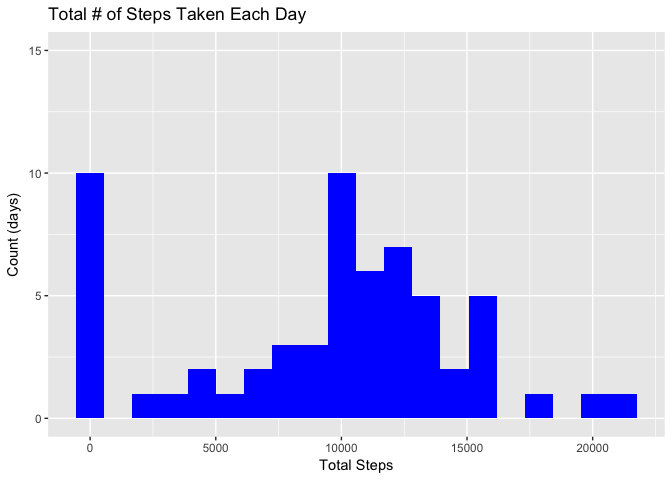

# Reproducible Research: Peer Assessment 1


## Loading and preprocessing the data


```r
unzip("activity.zip")
activityDf <- read.csv("activity.csv", colClasses = c("integer", "Date", "integer"))
```


## What is mean total number of steps taken per day?
**Ignoring missing values**

```r
library(dplyr, warn.conflicts = FALSE)

total_steps_by_day <- group_by(activityDf, date) %>%
  summarize(total_steps = sum(steps, na.rm = TRUE))

mean_steps = mean(total_steps_by_day$total_steps)
median_steps = median(total_steps_by_day$total_steps)
```

There is a **mean** of 9,354 and **median** of 10,395 steps taken each day.


```r
library(ggplot2)

orig_hist <- ggplot(total_steps_by_day, aes(x = total_steps)) + 
  geom_histogram(fill = "blue", bins = 20) + 
  ylim(0, 15) +
  labs(title = "Total # of Steps Taken Each Day", x = "Total Steps", y = "Count (days)")
orig_hist
```

<!-- -->

## What is the average daily activity pattern?
**Ignoring missing values**

```r
avg_steps_by_interval <- group_by(activityDf, interval) %>% 
  summarize(avg_steps = mean(steps, na.rm = TRUE))

max_avg <- max(avg_steps_by_interval$avg_steps)
max_interval <- filter(avg_steps_by_interval, avg_steps == max_avg)$interval[1]

ggplot(avg_steps_by_interval, aes(interval, avg_steps)) + 
  geom_line(color = "blue") +
  labs(title = "Average # of steps taken per 5-minute interval", x = "5-minute interval", y = "Average steps taken")
```

<!-- -->

The **5-minute interval** that has the **maximum average of steps** is 835

## Imputing missing values

```r
countnas <- nrow(filter(activityDf, is.na(steps)))
```

The **number of missing values** in the dataset is 2304


```r
# copy original data.frame
filledvals <- activityDf

# for the first missing value, finds the interval of the row
#   filledvals[ind[1,1],]$interval -----> 0
# for the specified interval of 0, gets the corresponding average steps
#   subset(avg_steps_by_interval, interval==0)$avg_steps ----- 1.716981

# fill in missing values until none remain
# must loop as there are 288 intervals, but initially more missing values
while (nrow(filter(filledvals, is.na(steps))) > 0) {
  # get the row and column for all remaining missing values
  ind <- which(is.na(filledvals), arr.ind=TRUE)
  # fill in missing values with the avg for the specified interval
  filledvals[ind] <- subset(avg_steps_by_interval, interval==filledvals[ind[,1],]$interval)$avg_steps
}
```


```r
filledin_total_steps_by_day <- group_by(filledvals, date) %>%
  summarize(total_steps = sum(steps))

filledin_mean_steps = mean(filledin_total_steps_by_day$total_steps)
filledin_median_steps = median(filledin_total_steps_by_day$total_steps)
```

### Originally
There is a **mean** of 9,354 and **median** of 10,395 steps taken each day.

### Filling in missing values with the average steps for the interval
There is a **mean** of 10,766 and **median** of 10,766 steps taken each day.


```r
library(ggplot2)
library(gridExtra, warn.conflicts = FALSE)

filled_hist <- ggplot(filledin_total_steps_by_day, aes(x = total_steps)) + 
  geom_histogram(fill = "blue", bins = 20) + 
  ylim(0, 15) +
  labs(title = "Total # of Steps Taken Each Day", x = "Total Steps", y = "Count (days)")
grid.arrange(orig_hist, filled_hist, nrow=1, 
             top="original (left) vs missing values filled in with interval average (right)")
```

<!-- -->


## Are there differences in activity patterns between weekdays and weekends?

```r
library(lubridate, warn.conflicts = FALSE)

avg_steps_by_daytype_by_interval <- filledvals %>%
  group_by(daytype = as.factor( ifelse(wday(date)==1 | wday(date)==7, "weekend", "weekday")), interval) %>% 
  summarize(avg_steps = mean(steps))

ggplot(avg_steps_by_daytype_by_interval, aes(interval, avg_steps)) + 
  geom_line(color = "blue") +
  facet_grid(daytype ~.) + 
  labs(title = "Average # of steps taken per 5-minute interval", x = "5-minute interval", y = "Average steps taken")
```

<!-- -->
